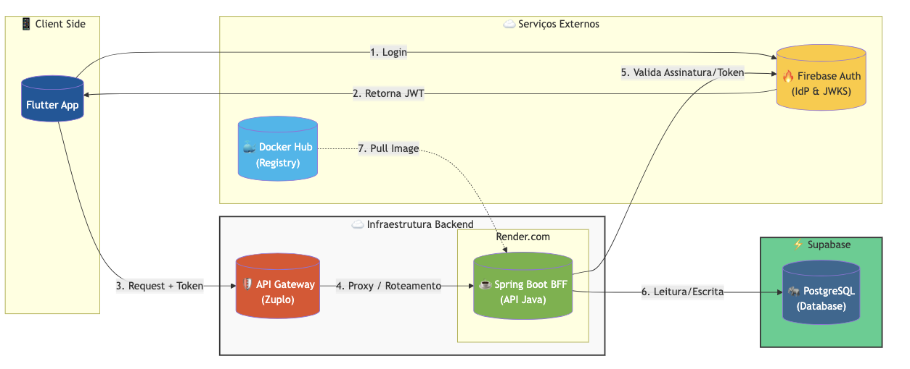

# bank123

A new Flutter project.

1 Configure a versao do Android minimo de 18

Emulador PIN: 12345

caminho: /Users/fabioalvaropereira/workspaces/tcc/Projeto Bank123/bank123

## 

Crie uma lista de contatos usando dio e getx para buscar a lista de contatos no servidor. 

Arquitetura
App FLutter > Backend Spring Boot Rest.

### Lista de Contatos
GET 192.168.1.100/bank123/bl/contatos
Header 
minha-conta:123456
Authentication:{meutoken}

{
dados:[
    {
        "nome":"Tatiana",
        "chavePix":{"tipo":"email","valor":"fabio.alvaro@email.com"}
    }
]
}

## BACKEND E BANCO

## FIREBASE LOGIN
projeto bank123
logar usando Email/Senha

## BACKEND
Spring Boot , Java 17, Spring Security
* vscode
* macbook
* Nos header sempre devem ir o Token jwt do Firebase e o id da conta(x-account-id) alem de um x-correlationId (x-correlationId )
localhost:8080/bff-bank123/extrato/v1/listagem
localhost:8080/bff-bank123/extrato/v1/saldo

Para acessar a documentacao do swagger gerada no springboot acesse: http://localhost:8080/swagger-ui/index.html

### BANCO DE DADOS
Utilizado como o banco de dados para guardar informações como o saldo e as movimentações da conta

Postgres SQL
usuario bank123
senha senhabank123
nome do banco bank123_db

- Contas
    numeroConta Integer
    dataCriacao DateTimeStamp
    saldo Float com duas casas decimais exemplo R$ 999.999.999,99
- livroCaixa
    idtransacao: 321654
    dataTransacao: DateTimeStamp
    valorTransacao 60,00
    numeroConta 123456
    operacao: ENTRADA/SAIDA
    destino: Fabio Pereira
    origem: Tatiana Favoretti

## 🏛️ Arquitetura da Solução

Este projeto adota uma arquitetura **Cloud Native** moderna, focada em segurança e separação de responsabilidades. O aplicativo Flutter atua como um cliente "burro" (stateless), delegando a lógica de negócios pesada para o Backend (BFF) e a identidade para o Firebase.

### Diagrama de Integração

### 🔄 Fluxo de Dados e Segurança

1.  **Autenticação (Identity Provider):**
    * O usuário realiza login via **Firebase Auth** (Google/Email).
    * O App recebe um **JWT (JSON Web Token)** assinado. Nenhuma senha é trafegada para o nosso backend.
    
2.  **API Gateway (Zuplo):**
    * Todas as requisições HTTP saem do App apontando para o **API Gateway**.
    * O App implementa **SSL Pinning** (via Dio) para garantir que está conversando com o Gateway legítimo, prevenindo ataques *Man-in-the-Middle*.

3.  **Backend for Frontend (BFF):**
    * O App envia o JWT no header `Authorization: Bearer <token>`.
    * O App aguarda respostas em JSON padronizado para montar as telas.

### 🛠️ Tech Stack Mobile
* **Framework:** Flutter (Dart)
* **Http Client:** Dio (com Interceptors para Auth e Logging)
* **State Management:** (Coloque o seu aqui: Provider/Bloc/Riverpod)
* **Auth:** Firebase Auth SDK